# Project 2 (uMessage) Write-Up #
--------

## Project Enjoyment ##
- What was your favorite part of the project? Why?
  <pre>
  Anupam: My favorite part was making graphs and analyzing the data structures, because I found the challenge to be fun.
  Alia: I most enjoyed the hallelujah moment when our AVLTree magically started working after many, many hours of fighting
  with it. I feel like I have a thorough understanding of how AVL trees work now.
  </pre>

- What was your least favorite part of the project? Why?
  <pre>
  Anupam: Writing ChainingHashTable wasn't fun, because it took a lot of debugging.
  Alia: I'm working on the general purpose dictionary tests right now, and it's irksome, because bugs keep popping up in
  weird places. It's deceptively difficult to get these dictionaries to cooperate and count steps the way I want them to.
  </pre>

- How could the project be improved? Why?
  <pre>
  Anupam: There are a lot of generics to deal with, which leads to a lot of confusion. I suggest either fewer generics or
  more coverage of them in preparation for the projects.
  Alia: I agree with Anupam. I can't really think of anything besides that.
  </pre>

- Did you enjoy the project?  Why or why not?
  <pre>
  Anupam: It was a lot of work, but I enjoyed it. It was fun because it was interesting.
  Alia: Yeah, I enjoyed it. Finally getting the tough code to work never fails to bring me joy. 
  (Also, Eliza's sassy; interacting with her to test out code was fun.)
  </pre>
    
-----

## Experiments ##
Throughout p1 and p2, you have written (or used) several distinct implementations of the Dictionary interface:
 - HashTrieMap 
 - MoveToFrontList
 - BinarySearchTree
 - AVLTree
 - ChainingHashTable
 
 In this Write-Up, you will compare various aspects of these data structures.  This will take a significant amount of
 time, and you should not leave it to the last minute.  For each experiment, we expect you to:
 - Explain how you constructed the inputs to make your conclusions
 - Explain why your data supports your conclusions
 - Explain your methodology (e.g., if we wanted to re-run your experiment, we would be able to)
 - Include the inputs themselves in the experiments folder
 - Include your data either directly in the write-up or in the experiments folder
 - If you think it helps your explanation, you can include graphs of the outputs (we recommend that you do this for some of them)
 - We recommend that you keep your "N" (as in "N-gram") constant throughout these experiments. (N = 2 and N = 3 are reasonable.) 
 - You should probably run multiple trials for each data point to help remove outliers.

### BST vs. AVLTree ###
Construct input files for BST and AVLTree to demonstrate that an AVL Tree is asymptotically better
than a Binary Search Tree. To do this, we expect you to show trends.  You might consider fitting a curve to
your results. Explain your intuition on why your results are what they are.

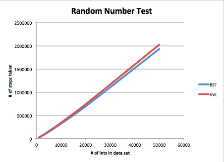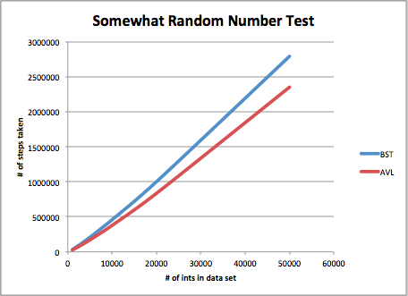
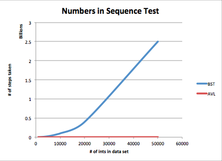

For this experiment, we came up with three styles of input to compare BSTs to AVL trees. One is a collection of random
numbers between 0 (inclusive) and the size of the data set (exclusive). Another is a collection of numbers generated by
taking the min of the loop iteration and a random number between 0 and the size of the data set for even-numbered loop
iterations, and the max of the loop iteration and a random number between 0 and the size of the data set for odd-numbered
loop iterations. (So, this collection is expected to be somewhat random, somewhat sequential). The last input is just the
sequential numbers from 0 to the size of the data set. The completely random and completely sequential inputs represent
extremes, and we expected the BST and AVL trees to perform about the same for the random input, and the AVL tree to
perform much better for the sequential input. By "perform better", I mean that it takes fewer steps to find and insert all
of the elements of a data set into one tree than another. We believed that the AVL tree would be better for the somewhat
random input, but we weren't sure about how much better. To test this, we called find and insert for each element in a
data set (for data sets of different sizes) and counted the number of steps it took total for all of the elements. We
counted steps by keeping count of all contiguous (in the same method) O(1) blocks of code as 1 step (so, if an O(1) block
of code is in a loop, we put one step increment statement, so it counts that O(1) block as 1 step for each iteration of
the loop). We averaged these step counts over 1000 trials for the random and somewhat random inputs in order to remove
outliers. Since the sequential input is the exact same input every time (meaning the same number of steps every time), we
did just one trial per data set size for that one. We tested these three types of input on BSTs and AVL trees for data
sets of integers of size 1000, 2000, 3000, 4000, 5000, 6000, 7000, 8000, 9000, 10000, 20000, and 50000. We used the
incCount method from the AVL tests in order to call find and insert for each integer key in the data set.

As it turns out, we had the right idea about how these would perform. The BST performs slightly better for the random
input, because randomly generated data here will give a reasonably balanced tree without the need for rotation. There is a
little bit of extra work to be done with AVL trees for rotation, so the BST's slightly better performance makes sense in
this case. But, as our graph shows, the difference is very slight. Then, the AVL Tree performs noticeably better than the
BST for the somewhat random input. It's not by much, but it's possible to tell that the sequential-esque part of this
input introduced a little bit of imbalance to the BST, which caused it to take more steps in the worst case, especially
for larger data set sizes. For input like this it looks like, asymptotically, the AVL tree is worth the extra work done
for rotation. Then, with the completely sequential input, it is clear that the AVL tree is the better choice, because the
BST's performance is terrible. It's just like a linked list here, so it takes far more steps than the AVL tree
asymptotically. Here is where we really see the difference between O(n) find and insert versus O(lg(n)) find and insert.
So, all in all I'd say we've shown that an AVL tree is a much better choice for sequential/sorted data, and it isn't
necessarily a bad choice for somewhat balanced data. If the data set is expected to be balanced, like in out random input
case, the BST might be the better choice, because it doesn't have to deal with the extra work of rotation.

All data and graphs have been included, and the code we wrote to test this out is in the "experiments" folder (this
includes our modified versions of BinarySearchTree.java, AVLTree.java, and then our testing client, BSTvsAVL.java).

### ChainingHashTable ###
Your ChainingHashTable should take as an argument to its constructor the type of "chains" it uses.  Determine
which type of chain is (on average) best: an MTFList, a BST, or an AVL Tree.  Explain your intuition on why
the answer you got makes sense (or doesn't!). 

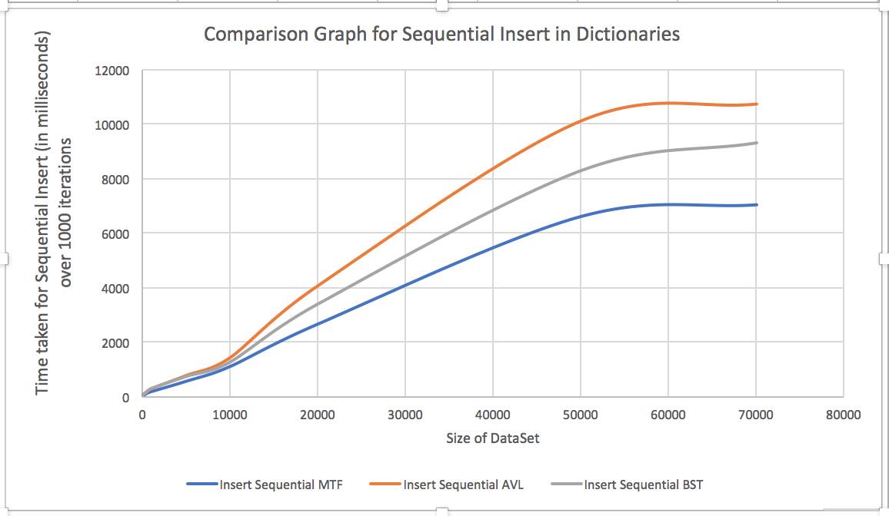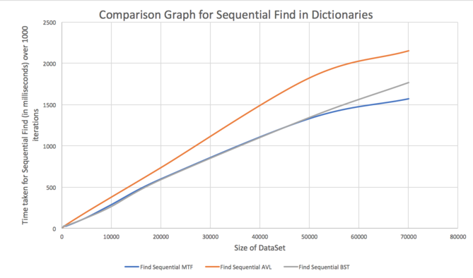
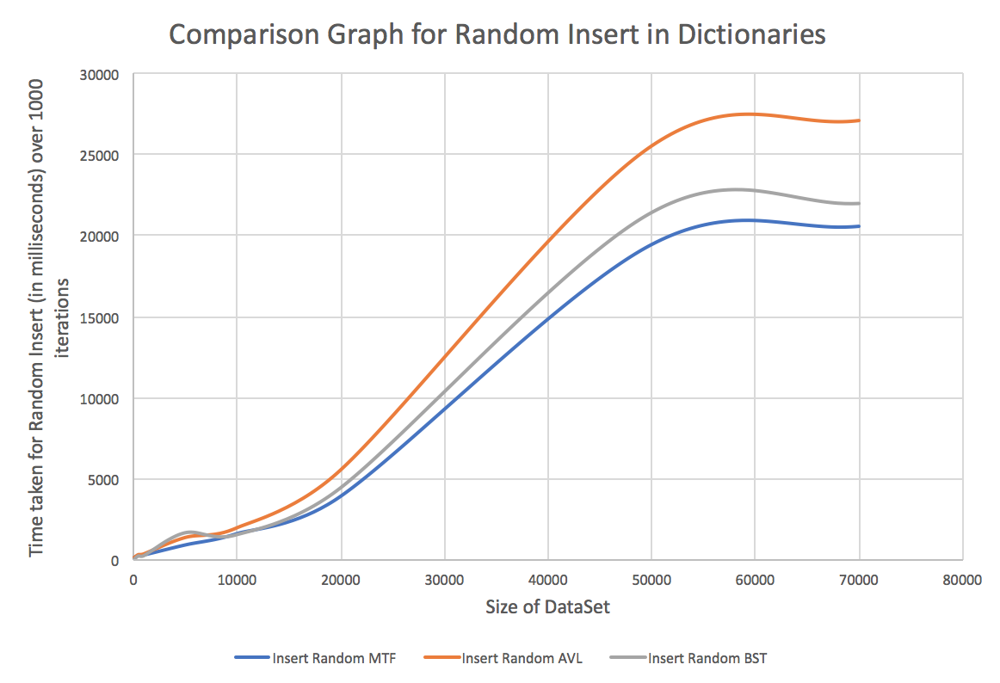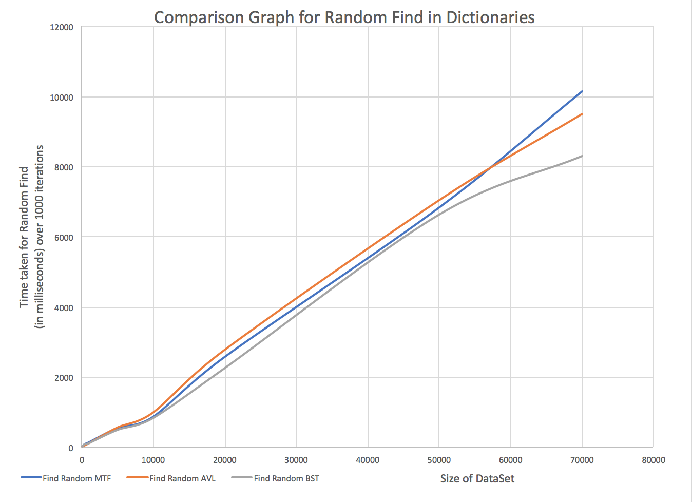

To Compare how Different Data structures performed with Chaining Hash Table, I created three different Hash Tables having
different suppliers – MoveToFrontList, AVL Tree and Binary Search Tree. Following this, I wrote 2 different kinds of 
tests :
1.	Sequential insert/ Find – Sequentially inserted all elements in the data set and count how much time it takes for
insertions/finds
2.	Random Insert/Find – Randomly generate key, value pairs and insert into the dictionaries and then find them. Count how 
much time it takes for these insertions/ finds. 
The tests were run multiple times during each call to reduce the error from anomalies. The size of the dataset was
incrementally changed and the data received was recorded and graphed to gain an asymptotic understanding of how the data
structures perform.
The test code was run on the same computer which provides a good idea about how the dictionaries perform when certain
algorithms are run on them. The only difference between the different chaining hash tables tested is the supplier that is
provided to them. 

Post experiments, we concluded that the MoveToFrontList was a better dictionary to use with ChainingHashTable than an
AVLTree or a Binary Search Tree. For our experiments, we used a data set whose size we kept increasing and each test was
run 1000 times to remove any outlying error possibilities. We used time as a good factor to compare the ADTs since they
all run on the same machine 1000 times and the increasing dataset size gives us an idea of the trend that the data
structures follow asymptotically. 

In our Sequential Insert tests, we found that asymptotically the MoveToFrontList performed better than the AVL Tree or the
BST. This made sense since in a sequential insert, all numbers inserted are larger than the numbers inserted before it,
hence the BST would essentially be a linked list similar to a MoveToFrontList. An AVL tree in this case would be bad since
every couple of inserts would need to have to rotate the tree in order to prevent the height condition being broken.
However, a MoveToFrontList was also better than the BST in this case since in a BST we are not aware of which direction to
take initially (and have to perform a check at every node) while the MoveToFrontList is unidirectional and traversing
through the list is marginally better. Although no elements were repeated, a MoveToFrontList performed better than a
Binary Search Tree because of how the elements are inserted. We believe that, although the runtime of find in both
MoveToFrontList and BinarySearchTree is pretty much the same in this case, MoveToFrontList was marginally better because
it doesn't ever have to do comparisons to see if it has to go left or right like BST does.

However, in some cases it also doesn’t make sense since logistically both of them in the case of a sequential insert are a
linkedlist and find on both of them should take the same amount of time. It is a bit odd that the MoveToFrontList performs
better than a Binary Search Tree considering adding items is O(1) and both of them add items the same way. So, the 
left-or-right factor slowing down the BST is our best guess, even though we didn't expect that.

For Random inserts, MoveToFrontList performed better than BinarySearchTree and AVL Trees. This made sense since random
inserts can have the same number being added multiple times which a MoveToFrontList is good for, because it accesses more
recent items quickly. In a BinarySearchTree and AVLTree, search would be about O(lgn) with reasonably distributed random
data. And then, the AVLTree has even more work to do than the BST, because it has to perform rotations, so it's slightly
slower than the BST. As we found in the BST vs AVL test, when the input is random, the BST does slightly better. Since the
inputs are completely random, we expect that distribution of inputs is almost balanced over 1000 iterations. Hence, it
makes sense that MTFList performs better in the case of random inserts since repeated elements give it the advantage over
both trees.

We also compared the time needed by just the find algorithms on each list, without inserting. In this as well, we found
some solid results on why the MoveToFrontList was best for ChainingHashTable. Over 1000 iterations, we found that the
MoveToFrontList performed about the same as BSTs in sequential finds, which makes sense, since in a sequential find, the
BST is basically a LinkedList same as a MoveToFrontList. We need to iterate through the entire list to find something, and
in this case each element is unique, so MTFList's good access to recently looked at items is not taken advantage of. Both
of these were better than the AVLTree, which is confusing, because AVLTree is supposed to be better than the BST for
sequential data. Our best guess is that there was noise that threw off the results slightly (it is, after all,
milliseconds we're talking about). At least the BST and AVL trees performed as expected in the last test, with step
counting. (I believe we're seeing for ourselves how step counting can be more accurate). For Random Finds, the time taken
for each of the dictionaries was almost linearly related to the size of the data set and all the dictionaries ranked
pretty close. This was primarily because the data in a BST and AVL Tree was comparatively stored while in a
MoveToFrontList the data was stored based on which number was found first. Hence, the finds took almost the same time as
each other and were dependent on the size of the dataset. 

The data to support these conclusions along with the graphs have been attached. 

To repeat this experiment, one needs to run WriteUpHashTableTests.java in the CSE332 -> Experiments folder. There are two
variables at the starting of the program: n, which is the size of the data set, and number, which is how many times each
test should be run to reduce errors. These can be changed accordingly.

### Hash Functions ###
Write a new hash function (it doesn't have to be any good, but remember to include the code in your repository).
Compare the runtime of your ChainingHashTable when the hash function is varied.  How big of a difference can the
hash function make?  (You should keep all other inputs (e.g., the chain type) constant.)  Explain your intuition on
why your results are what they are.

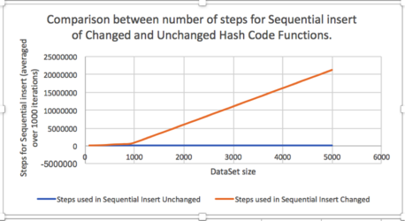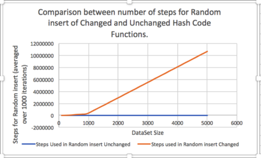
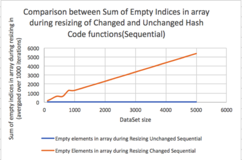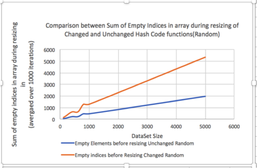
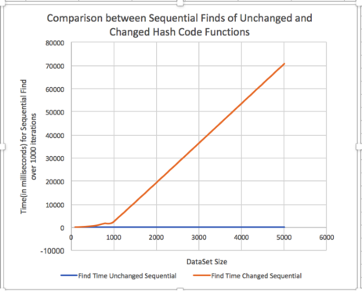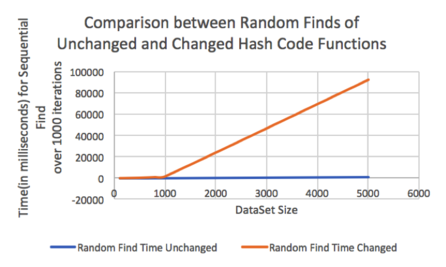
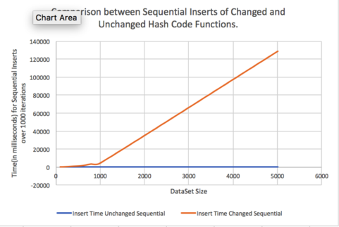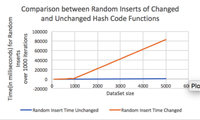

In order to test the difference between the ChainingHashTables with different Hash Functions, I copied over
Dictionary.java, MoveToFrontList.java and ChainingHashTable.java over to the Experiments folder and added a step counter
to MoveToFrontList and ChainingHashTables. Following this, I created another copy of the stepped ChainingHashTable and
changed the hash function such that based on the hash code of they key, the values would just be stored in 2 indices in
the underlying array. After having made sure both files compiled without error, I wrote a testing file that created
objects of both these classes and ran two different tests on them:

1.	Sequential – Inserted all elements up to the size of the dataset in a sequential order, followed by a find for each
element in the dataset individually.
2.	Random – Inserted randomly generated numbers into both the datasets followed by a find for each element in the
inputted random dataset individually.

For each of these experiments, I recorded how much time it took for the inserts/finds to finish, how many steps insert
took and how many indices of the array were empty when it was resized owing to its load factor. This data was taken over a
specified dataset iterated over 1000 times to reduce error and then averaged over the 1000 iterations to get an accurate
value, without the outliers having much of an effect.  The data has been provided in the input files. Once the data had
been collected, we compared the trends based on graphs made on the data.

After thorough testing, we concluded that changing a hash function can drastically alter the run time of the
ChainingHashTable. The difference between how much time the hash function took for the same data that needed to be
inserted showed clearly how the algorithms performed with the different hash functions. 

Attached is the graph for the data number of steps taken for Sequential Insert for both Hash Tables. As is evident in the
graph, the sequential insert, although it starts out almost the same for the unchanged and changed hash function tables,
as the size of the data set increases, the difference between them is in multiple thousands of milliseconds. This is
primarily because all inserts in the new changed hash table happen in the same 2 indices. This would mean finding and
inserting in a list that is massively large asymptotically, as the chain we used was a MoveToFrontList. However, with the
original hash table, the data would be more uniformly distributed and insertion would take much less time because there
the data was spread out through the hash table. In addition, resize would have to be called multiple times on the changed
hash table while transferring the same elements in the same list into an equivalent index in the array. In addition, since
insert depends on find, with a larger list and all elements being entered in the same 2 lists, the find operation takes a
lot more time than the operation on the original Chaining Hash Table. The same trends can be observed for random inserts
into both the lists in the graph attached.

To check for space utilization, every time the chaining hash table needed to be resized, I checked how many indices in the
previous table were empty and checked how the results were. As expected, the results with unchanged hash function hash
table were massively lesser than that with the changed hash function since the unchanged hash table let the elements be
placed everywhere in the table while the changed specified only places the elements one of 2 indices. The number of empty
indices in array during resizing for sequential unchanged is so close to zero since the tests inserted <Integer, Integer>
key/value pairs and the hash code for an integer is the number itself, hence each element in sequential was added to an
index that came after that. Following this, for the sequential experiment, the empty indices in Unchanged Hash table
before resizing were 0 in all data sets.

The find algorithm for the two Chaining Hash Tables also varied a lot since in the unchanged hash table, the find would
just need to figure out the index and find in the dictionary which for a MoveToFrontList is O(n). However, in the changed
hash table since the elements all go into 2 indices, the dictionaries at the indices have a much larger size than the
average dictionary at each index in the unchanged hash table. Hence, observing the find algorithms for the Sequential and
Random finds – we see that the steps needed to find as well as the time required to find an element were drastically
different with the unchanged hash table performing much better. 

Following this, the time needed for inserts has also been added as a medium to compare how fast the algorithms execute.
The algorithms were executed on the same machine keeping everything else constant except the hash function.

Hence, we conclude that changing the hash function has a major impact on how the Chaining Hash Table functions performs.
Using a poor hash function makes using a Chaining Hash Table much more inefficient, so having a good hash function is
important, regardless of the chain used. Even with MTFList, our best chain, the ChainingHashTable with the bad hash
function performed very badly.

In order to run the experiment, one could go to the CSE 332 →  Experiments folder and open
ChainingHashTableComparisonTest.java. The file contains 2 static final variables which can be altered to change the
dataset and how many iterations are performed. The variable n denotes the dataset and the variable number denotes how many
times each test will be run to remove outliers. The original ChainingHashTable can be found as ChainingHashTableCopy.java
and the hash table with the changed hash function can be found in ChainingHashTableChangedHashFunction.java, both of which
can be found in the same folder. The csv file with the data can also be found there.

### General Purpose Dictionary ###
Compare BST, AVLTree, ChainingHashTable, and HashTrieMap on alice.txt.  Is
there a clear winner?  Why or why not?  Is the winner surprising to you?

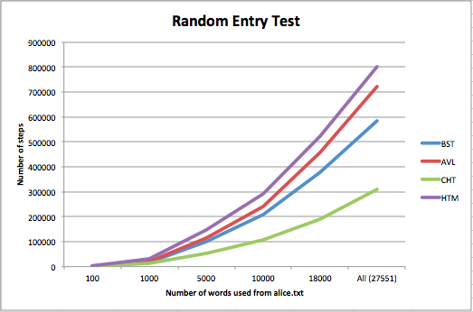
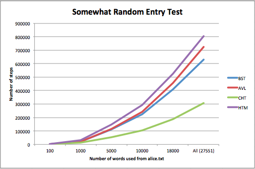
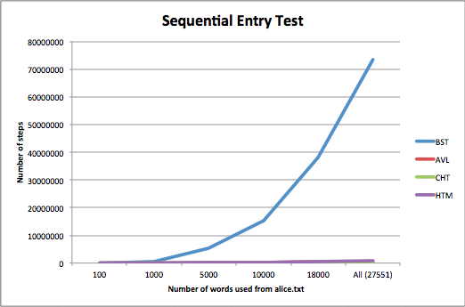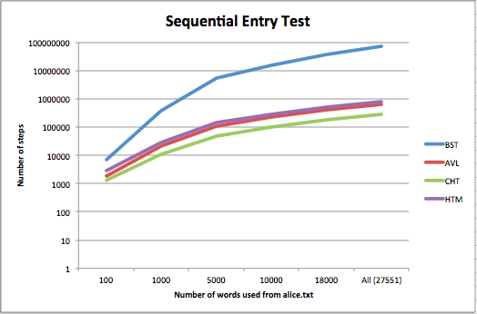

As is always the case, these data structures all have tradeoffs, so the "winner" in one situation may be terrible for a
different job. That said, the winner here seems to be ChainingHashTable. We aren't very surprised by that, because there
are a lot of repeated words in our data set, and the chain used in our CHT, MoveToFrontList, is designed to be efficient
when accessing items that have been recently accessed. Before we analyze our results further, we'll explain our
experiment.

We used the same idea that we used for comparing Binary Search Trees and AVL Trees; we wanted to test our data structures'
performance on randomly entered data, somewhat randomly entered data, and sequentially entered data. In this case, our
three inputs were words chosen randomly from the specified subset of alice.txt, words chosen from a sorted version of
alice.txt by using as an index the minimum or maximum of the loop iteration and a random number from 0 to the data set
size, and the words of alice.txt entered in completely sorted alphabetical order. For each input, we tested how many steps
it took to find and insert all of the words for each data structure (Binary Search Tree, AVL Tree, Chaining Hash Table,
and Hash Trie Map). We counted each contiguous block of O(1) code in these data structures as one step, which meant
incrementing the step count at the beginning of each method and in every loop, without forgetting to count the steps for
method calls to other data structures. (For the exact code we used, see AliceTests.java in the experiments folder). We
used the incCount method from the AVLTree tests in order to test both find and insert on these data structures (so, we
were recording the number of times we'd seen each word). We averaged these tests over 500 trials for both the random and
somewhat random input, and only did one trial for the completely sequential input (because it's the same number of steps
every time for that one). We tested each data structure on a subset of the words in alice.txt: the first 100, the first
1000, the first 5000, the first 10000, the first 18000, and the whole thing (27551 words). 

The data we got is pretty consistent with what we expected. We knew that ChainingHashTable would perform well, as I said,
because of repeated words. It makes sense that CHT performed slightly better, too, with the sequential/alphabetical data
than it did with the random data, because then all of the accesses of repeated words were happening in contiguous chunks.
It was with our decent hash function, too, and not the horrible one from the last experiment. Though it performed slightly
better on the more sequential data, it also did really well with the random data, because if words are randomly chosen
there are still probably going to be repeats, and the good hash function gives us a good load factor. All in all,
ChainingHashTable clearly wins, because it takes far fewer steps asymptotically than the other three data structures.

Then, BinarySearchTree performed next best asymptotically on the random and somewhat random input. This is not a surprise,
given what we observed of its behavior in the BST vs AVL experiment. It ends up being reasonably well balanced with random
data because random data is pretty evenly distributed (especially with large data sets) and it doesn't do all of the work
that AVL tree does to rotate. Thus, it gives logarithmic (or close to logarithmic) find and insert time without the
overhead work of rotation. So, it makes sense that it performed better with both the random and somewhat random data than
the AVL tree. In these cases, the data didn't cause enough imbalance in the tree to make AVL's rotations worthwhile. It's
interesting that we observed that the AVL tree did slightly better with the somewhat random data in experiment #1, but the
BST did slightly better with the somewhat random data here, even though we used the exact same algorithm to get the
somewhat random input data. Our guess is that is happening because our algorithm is pretty balanced between being random
and sequential, so it could go either way. In both experiments, the step counts are close. As for the completely
sequential input, as we expected, the BST performed terribly. (I actually decided to include a graph with a logarithmic 
y-axis in addition to the linear one, because the BST's step count left all the others in the dust and they all looked the
same in the linear graph.) The AVL tree did much better for the sequential input (second best, in fact), as it did in
experiment #1. When the data is completely sequential, the overhead work for rotations saves a lot of find/insert time
asymptotically because it is still O(lgn) while the BST becomes O(n).

HashTrieMap is the clearest poor choice here (disregarding BST's abysmal performance on sequential input). It performed
worst on the random and somewhat random data, and second-worst on the sequential data. Now we see why we had to replace
the tries used originally for uMessage to get uMessage to work. HashTrieMap may have good space complexity, being able to
save on space with words with similar prefixes, but traversing each word letter by letter evidently takes time. Not too
much more time than the AVL tree, as we see, but still. The number of letters it has to traverse through in a word (plus
the underlying ChainingHashMap traversing in the pointers) in each of its nodes may very well take more steps than are
necessary to get to a specific node traversing through an AVL tree. For each entry, HTM has to traverse through the entire
word (making it O(k) where k is the length of the word), whereas only half of the AVL tree's nodes are the bottom (worst
case) and the AVL tree's find and insert are O(lgn).

So, in conclusion, based on what we've learned about these data structures' strengths and weaknesses, the results of these
tests make sense for these inputs. Because these are all dictionaries, they all get the job done, but ChainingHashTable is
our dictionary of choice here.

### uMessage ###
Use uMessage to test out your implementations.  Using N=3, uMessage should take less than a minute to load using
your best algorithms and data structures on a reasonable machine.

 -  How are the suggestions uMessage gives with the default corpus? (here we mean spoken.corpus or irc.corpus, not eggs.txt)
    <pre>
The suggestions by the default corpus are words that are grammatically correct and make sense as English words. As the
user clicks on a word, different words are suggested which if attached to the first word selected would make sense as a
part of a sentence or a whole sentence. Although the suggestions are not usually arranged in a specific lexicographical
order, sometimes the suggestions are arranged in proper order (lexicographically). On further investigation using
irc.corpus, we found that the suggestions we were receiving were consistent with the style of irc.corpus.
    </pre>

 - Now, switch uMessage to use a corpus of YOUR OWN text. To do this, you will need a corpus. 
   You can use anything you like (Facebook, google talk, e-mails, etc.)  We provide
   instructions and a script to format Facebook data correctly as we expect it will be the most common
   choice.  If you are having problems getting data, please come to office hours and ask for help.
   Alternatively, you can concatenate a bunch of English papers you've written together to get a corpus
   of your writing.  PLEASE DO NOT INCLUDE "me.txt" IN YOUR REPOSITORY.  WE DO NOT WANT YOUR PRIVATE CONVERSATIONS.
     * Follow these instructions to get your Facebook data: https://www.facebook.com/help/212802592074644
     * Run the ParseFBMessages program in the p2.wordsuggestor package.
     * Use the output file "me.txt" as the corpus for uMessage.
 
 - How are the suggestions uMessage gives with the new corpus?
   <pre>
When the file was replaced by some of our past essays, the words that were suggested were actual words that were
grammatically correct and made sense as English words. The interesting thing about the suggestions was that it seemed as
if the next word in the sentence I was writing in the input box was already in the suggestions box. For Example, we added
in review essays about a play we had seen followed by multiple versions of our cover letters, when we wrote “this”, the
words suggested were “play”, “year” and “project” which was exactly the sequence of words that we had in our essays/ cover
letters and what we wanted to make the sentence into. The suggestions seemed to predict what we were going to write based
on the text we had inserted into me.txt. Although there didn’t seem to be a natural ordering to the way in which the
suggestions were presented, in some cases, the suggestions were lexicographically arranged. It was also interesting that
the word suggestor knew when we would like to enter an article in the sentence like “a”, “an” or “the” and gave us a
suggestion about it.
   </pre>

-----

## Above and Beyond ##
-   Did you do any Above and Beyond?  Describe exactly what you implemented.
 <pre>Sadly, we didn't have the time to try any A&B. </pre>
