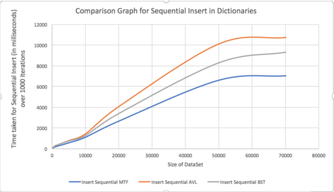
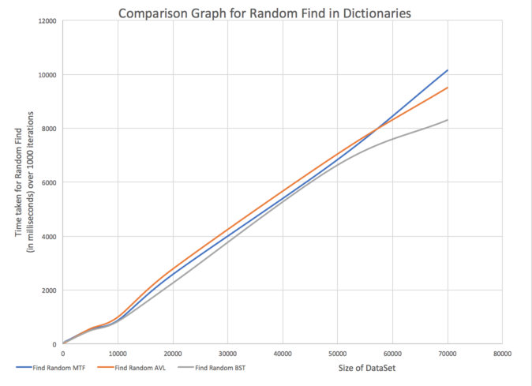

# Project 2 (uMessage) Write-Up #
--------

## Project Enjoyment ##
- What was your favorite part of the project? Why?
  <pre>
  Anupam: My favorite part was making graphs and analyzing the data structures, because I found the challenge to be fun.
  Alia: I most enjoyed the hallelujah moment when our AVLTree magically started working after many, many hours of fighting
  with it. I feel like I have a thorough understanding of how AVL trees work now.
  </pre>

- What was your least favorite part of the project? Why?
  <pre>
  Anupam: Writing ChainingHashTable wasn't fun, because it took a lot of debugging.
  Alia: I'm working on the general purpose dictionary tests right now, and it's irksome, because bugs keep popping up in
  weird places. It's deceptively difficult to get these dictionaries to cooperate and count steps the way I want them to.
  </pre>

- How could the project be improved? Why?
  <pre>
  Anupam: There are a lot of generics to deal with, which leads to a lot of confusion. I suggest either fewer generics or
  more coverage of them in preparation for the projects.
  Alia: I agree with Anupam. I can't really think of anything besides that.
  </pre>

- Did you enjoy the project?  Why or why not?
  <pre>
  Anupam: It was a lot of work, but I enjoyed it. It was fun because it was interesting.
  Alia: Yeah, I enjoyed it. Finally getting the tough code to work never fails to bring me joy. 
  (Also, Eliza's sassy; interacting with her to test out code was fun.)
  </pre>
    
-----

## Experiments ##
Throughout p1 and p2, you have written (or used) several distinct implementations of the Dictionary interface:
 - HashTrieMap 
 - MoveToFrontList
 - BinarySearchTree
 - AVLTree
 - ChainingHashTable
 
 In this Write-Up, you will compare various aspects of these data structures.  This will take a significant amount of
 time, and you should not leave it to the last minute.  For each experiment, we expect you to:
 - Explain how you constructed the inputs to make your conclusions
 - Explain why your data supports your conclusions
 - Explain your methodology (e.g., if we wanted to re-run your experiment, we would be able to)
 - Include the inputs themselves in the experiments folder
 - Include your data either directly in the write-up or in the experiments folder
 - If you think it helps your explanation, you can include graphs of the outputs (we recommend that you do this for some of them)
 - We recommend that you keep your "N" (as in "N-gram") constant throughout these experiments. (N = 2 and N = 3 are reasonable.) 
 - You should probably run multiple trials for each data point to help remove outliers.

### BST vs. AVLTree ###
Construct input files for BST and AVLTree to demonstrate that an AVL Tree is asymptotically better
than a Binary Search Tree. To do this, we expect you to show trends.  You might consider fitting a curve to
your results. Explain your intuition on why your results are what they are.
<pre>

</pre>
<pre>
For this experiment, we came up with three styles of input to compare BSTs to AVL trees. One is a collection of random
numbers between 0 (inclusive) and the size of the data set (exclusive). Another is a collection of numbers generated by
taking the min of the loop iteration and a random number between 0 and the size of the data set for even-numbered loop
iterations, and the max of the loop iteration and a random number between 0 and the size of the data set for odd-numbered
loop iterations. (So, this collection is expected to be somewhat random, somewhat sequential). The last input is just the
sequential numbers from 0 to the size of the data set. The completely random and completely sequential inputs represent
extremes, and we expected the BST and AVL trees to perform about the same for the random input, and the AVL tree to
perform much better for the sequential input. By "perform better", I mean that it takes fewer steps to find and insert all
of the elements of a data set into one tree than another. We believed that the AVL tree would be better for the somewhat
random input, but we weren't sure about how much better. To test this, we called find and insert for each element in a
data set (for data sets of different sizes) and counted the number of steps it took total for all of the elements. We
counted steps by keeping count of all contiguous (in the same method) O(1) blocks of code as 1 step (so, if an O(1) block
of code is in a loop, we put one step increment statement, so it counts that O(1) block as 1 step for each iteration of
the loop). We averaged these step counts over 1000 trials for the random and somewhat random inputs in order to remove
outliers. Since the sequential input is the exact same input every time (meaning the same number of steps every time), we
did just one trial per data set size for that one. We tested these three types of input on BSTs and AVL trees for data
sets of integers of size 1000, 2000, 3000, 4000, 5000, 6000, 7000, 8000, 9000, 10000, 20000, and 50000. We used the
incCount method from the AVL tests in order to call find and insert for each integer key in the data set.
</pre>
<pre>
As it turns out, we had the right idea about how these would perform. The BST performs slightly better for the random
input, because randomly generated data here will give a reasonably balanced tree without the need for rotation. There is a
little bit of extra work to be done with AVL trees for rotation, so the BST's slightly better performance makes sense in
this case. But, as our graph shows, the difference is very slight. Then, the AVL Tree performs noticeably better than the
BST for the somewhat random input. It's not by much, but it's possible to tell that the sequential-esque part of this
input introduced a little bit of imbalance to the BST, which caused it to take more steps, especially for larger data set
sizes. For input like this, it looks like, asymptotically, the AVL tree is worth the extra work done for rotation. Then,
with the completely sequential input, it is clear that the AVL tree is the better choice, because the BST's performance is
terrible. It's just like a linked list here, so it takes far more steps than the AVL tree asymptotically. Here is where we
really see the difference between O(n) find and insert versus O(lg(n)) find and insert. So, all in all I'd say we've shown
that an AVL tree is a much better choice for more sequential/sorted data, and it isn't necessarily a bad choice for non-
sequential/random data.
</pre>

### ChainingHashTable ###
Your ChainingHashTable should take as an argument to its constructor the type of "chains" it uses.  Determine
which type of chain is (on average) best: an MTFList, a BST, or an AVL Tree.  Explain your intuition on why
the answer you got makes sense (or doesn't!). 
<pre>

</pre>

<pre>

</pre>
 
### Hash Functions ###
Write a new hash function (it doesn't have to be any good, but remember to include the code in your repository).
Compare the runtime of your ChainingHashTable when the hash function is varied.  How big of a difference can the
hash function make?  (You should keep all other inputs (e.g., the chain type) constant.)  Explain your intuition on
why your results are what they are.
<pre>TODO</pre>

### General Purpose Dictionary ###
Compare BST, AVLTree, ChainingHashTable, and HashTrieMap on alice.txt.  Is
there a clear winner?  Why or why not?  Is the winner surprising to you?
<pre>TODO</pre>

### uMessage ###
Use uMessage to test out your implementations.  Using N=3, uMessage should take less than a minute to load using
your best algorithms and data structures on a reasonable machine.

 -  How are the suggestions uMessage gives with the default corpus? (here we mean spoken.corpus or irc.corpus, not eggs.txt)
    <pre>TODO</pre>

 - Now, switch uMessage to use a corpus of YOUR OWN text. To do this, you will need a corpus. 
   You can use anything you like (Facebook, google talk, e-mails, etc.)  We provide
   instructions and a script to format Facebook data correctly as we expect it will be the most common
   choice.  If you are having problems getting data, please come to office hours and ask for help.
   Alternatively, you can concatenate a bunch of English papers you've written together to get a corpus
   of your writing.  PLEASE DO NOT INCLUDE "me.txt" IN YOUR REPOSITORY.  WE DO NOT WANT YOUR PRIVATE CONVERSATIONS.
     * Follow these instructions to get your Facebook data: https://www.facebook.com/help/212802592074644
     * Run the ParseFBMessages program in the p2.wordsuggestor package.
     * Use the output file "me.txt" as the corpus for uMessage.
 
 - How are the suggestions uMessage gives with the new corpus?
   <pre>TODO</pre>

-----

## Above and Beyond ##
-   Did you do any Above and Beyond?  Describe exactly what you implemented.
 <pre>Sadly, we didn't have the time to try any A&B. </pre>
